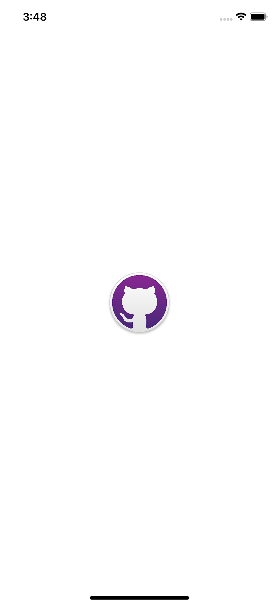
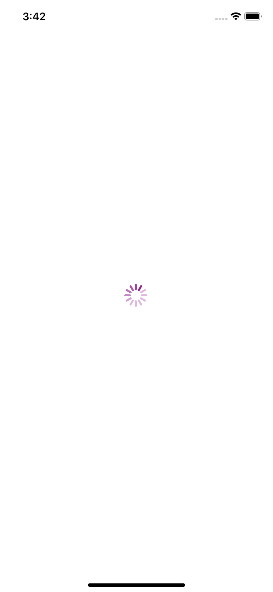
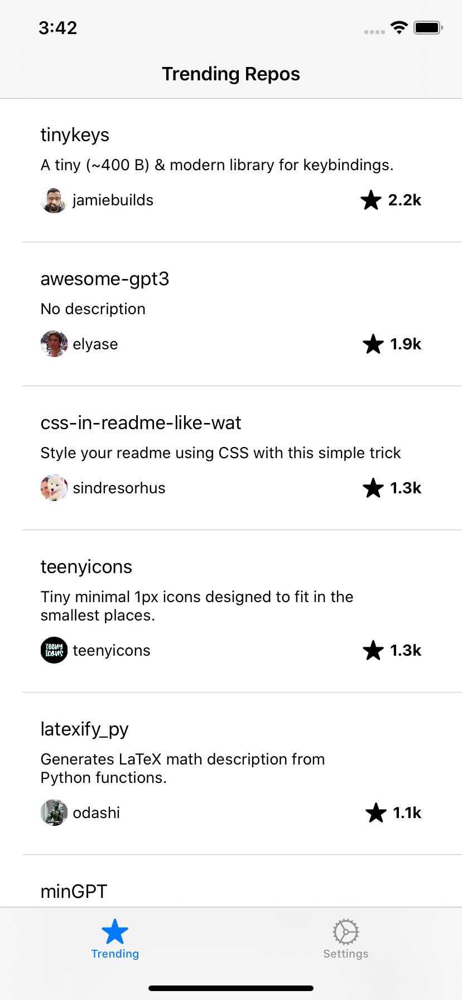
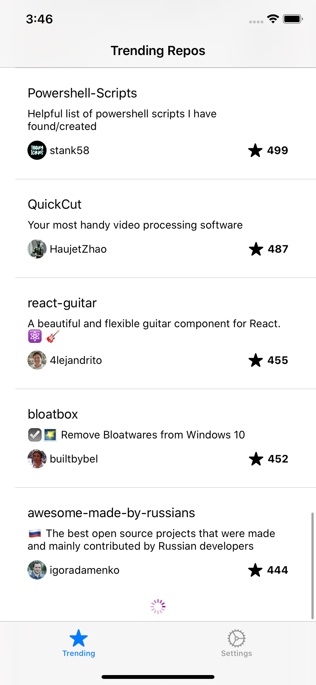

# Gemography Repos App
[](https://www.apple.com/swift/)

This is the repository of the Github repositories Application developed using Swift language 

## Table of contents
* [Project context](#project-context)
* [Environment](#environment)
* [Features](#features)
* [Design Patterns](#design-patterns)
* [Screenshots](#screenshots)
* [License](#license)

## Project context
As part of the Mobile Coding Challenge of Gemography, I've worked on a mobile app that list the most starred Github repositories created in the last 30 days.

## Environment
The project have created with:
- XCode Version 11.6
- Swift 5.2
- Cocoapods 1.9.1
- Alamofire 5.2.1
- PromiseKit 6.13.1

## Features
1. List the most starred Github repos that were created in the last 30 days. __ ✅ 
2. The results must be fetched in a list, each row present one repository. ____ ✅ 
3. Each row contains the repository details (name, description, stars, owner).  ✅ 
4. infinite scroll or pagination allows users to load content continuously. _____ ✅  

## Design Patterns

### MVVM architecture

The application have creates base on the MVVM Pattern. The Model-View-ViewModel pattern helps to cleanly separate the business and presentation logic of an application from its user interface (UI).
There are three core components in the MVVM pattern: 

- **Model** defines core types and implements application business logic. It contains NetworkManager, Services (Repository layer), Http routers and `Owner` & `Repository` models (Structs)
- **View** defines the layout, appearance and structure of the UI. It contains the UI's visual elements like Storyboards, UI Views components(Cells, refreshControllers, etc ), View data source for tableViewController  
- **View Model** is the responsible for telling the View what should be shown to the user and to respond to whatever the user does in the UI

### The Singleton Pattern
The Singleton design pattern ensures that only one instance exists for a Alamofire Session Manager class (NetworkManager) and that there’s a global access point to that instance

```swift

final class NetworkManager {
    
    // MARK: Attributes
    private let session : Session

    // MARK: Accessors
    static var sharedInstance: NetworkManager = {
        NetworkManager( sessionManager: Session() )
    }()
    
    // MARK: Initializer
    private init( sessionManager : Session) {
        session = sessionManager
    }
    
}

```

### The Observer Pattern
The observer pattern is a design pattern that defines a link between objects so that when one object's state changes, all dependent objects are updated automatically. This pattern allows communication between objects in a loosely coupled manner.

To be able to bind values from repository ViewModel to TableViewController, we need element with an observable pattern, in this application I used the “didSet” observer.

```swift

typealias CompletionHandler = (() -> Void)

class Observer<T> {
    
    // MARK: Propreties

    var value : T {
        didSet {
            self.notify()
        }
    }
    
    private var observers = [String: CompletionHandler]()
    
    // MARK: Initializer
    init(_ value: T) {
        self.value = value
    }
    
    // MARK: Functions
    
    public func addObserver(_ observer: NSObject, completionHandler: @escaping CompletionHandler) {
        observers[observer.description] = completionHandler
    }
    
    public func addAndNotify(observer: NSObject, completionHandler: @escaping CompletionHandler) {
        self.addObserver(observer, completionHandler: completionHandler)
        self.notify()
    }
    
    private func notify() {
        observers.forEach({ $0.value() })
    }
    
    // MARK: Deinitialization
    deinit {
        observers.removeAll()
    }
}

```
### Generalization
To avoid writing the same code over and over and to encapsulate the required boilerplate by means of a set of abstractions. 
For this reason, I created a generic dataSource that I can reuse regardless the data I would like to update.

```swift

class GenericDataSource<T> : NSObject {
    
    var data: Observer<[T]> = Observer([])
    var count : Int {
        data.value.count
    }
    
}

```

### Promise pattern
The asynchronous functions are nested inside one another that can lead to “Pyramid of Doom“ in our code. One of the approach the computer scientists discover to solve this kind of problem is by using Promise pattern.
In this pattern, promise is an object that represents the eventual completion (or failure) of an asynchronous task.  

To integrate Promise into this iOS Application, I used a Cocoapods libraries named [PromiseKit](https://github.com/mxcl/PromiseKit)


## Screenshots

| Launch Screen | Initializing data | Repos List Screen | Infinite Scroll |
| :---: | :---: | :---: | :---: |
|  |  |  |  |

## License

[](http://badges.mit-license.org)

- **[MIT license](http://opensource.org/licenses/mit-license.php)**
- Copyright 2020 © <a href="https://ma.linkedin.com/in/saadmansouri" target="_blank">Saad Mansouri</a>.
